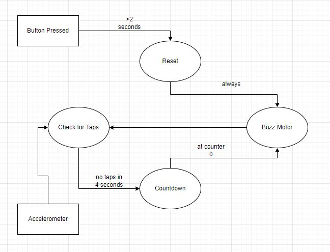

#### by: Zach Miller A16568617

##ReadMe

---
Started: 4/18/2022

---
---
**Tutorial 1** :

This tutorial takes you through the steps of downloading the library for the
OLED display and learning how to communicate with it through Arduino. We first
create a new tab in Arduino named Display that we will re-use throughout the 
challenge files. This new tab has functions named writeDisplay and 
writeDisplayCSV that will be important later.

---
---
**Tutorial 2** :

Similar to Tutorial 1, we will create a tab devoted to the Accelerometer to
be reused throughout the rest of the lab. We use global variables ax, ay, and
az to recieve the values being read from the accelerometer, so in our code
we only need to call our read accelerometer function and then these values
will be automatically updated.
Note the following:
* the y axis is the value of the x movement and the x-axis is time
* there is a certain angle at which all the accelerometer values are equivalent
---
---
**Tutorial 3** :
This will take us through creating a tab for our motor included in the kit.
Specifically it will show us how PWM affects the motor speed and how sending
a high and low signal on a specific clock will change how fast the motor is 
buzzing. We then have access to functions to set the motor speed and
deactivate it, without having to worry about any PWM characteristsics in our
main code.
---
---
**Tutorial 4** :

Here, we can see the benefit to checking that we are able to sample and write
to the serial before actually attempting to do so. By making sure both are
possible, we are making sure that our code is not stuck at some point
or trying to send data when it is not able to be sent in the first place. We
will also create a new tab named sampling that we will use later on in the 
challenges.
---
---
**Tutorial 5** :

Finally, we will learn how to have python and arduino communicate: a key
function into having integrated hardware and software. We muyst keep track of 
the port that our Arduino uses: for me COM4. We must also decide if we are to 
use bluetooth for the communication to happen. My computer does not have
blutetooth capabilities so throughout this tutorial and the lab, I will stick
to using USB instead. The key takeway from this section is the send_message
function and the time.sleep function, the first of which sends to arduino a 
message to display, and the second a wait time before it does it again.
---
---
**Challenge 1 and 2** :

1. To detect taps I went a bit more complicated that needed looking back on it,
however I had designed it with the impression that it would work in any 
starting orientation, instead of always oriented in the same plane. I would
initially loop through the program before checking for taps, to create an 
average value for what each x y and z should be. Then I would check if the
current sample was much greater than the average by an integer I defined at the
top of the code. By making this value an integer I could "tune" the sensitivity
of what was considered a tap. Then it was just a matter of displaying that int
to the OLED which was done by clearing and re-updating it every loop.

2. First we had to make a finite state machine picture for the operation as shown 
here:

Then we had to implement logic for the following conditions. If the accelerometer 
has been tapped, then incremement the counter by 1, if the counter hasn't increased
in 4 seconds, decrement the counter by 1 every second, and if the button is pressed
for over 2 seconds, set the counter to 0. I used the skeleton of the Challenges
from lab2 where we did a similar process using a button to count up instead of the
accelerometer. Then created the logic for figuring out how long a button is pressed
which just makes sure that if the button is held for over 2 seconds it stays at 0.
Otherwise the rest of the program follows the same basic structure as the Previous
challenges. We also had to have a motor buzz at 0 which was done simply by an if
else at the end of the loop to either set the motor on(255) or off.

---
---
**Challenge 3** :

The main point here is to gather information from the repository that we gain 
access to from the OWM library. I chose to display the Date, Time, Temp, and
type of day(sunny,cloudy,etc.). I could use the functions from OWM to get
the temp and type of day. I got the date from dateTime, and the time from the
time library. I then took all these values and converted them into strings as 
some were in dict form instead of string form. After, I could append them
together with commas between and send that message to Arduino. I used commas
because of the CSV function from earlier that would display a message on multiple
lines using commas asa delimiter. The only other trick was to make sure the sleep
was set to 1 second in python.

---