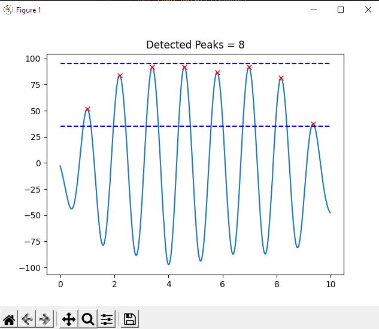
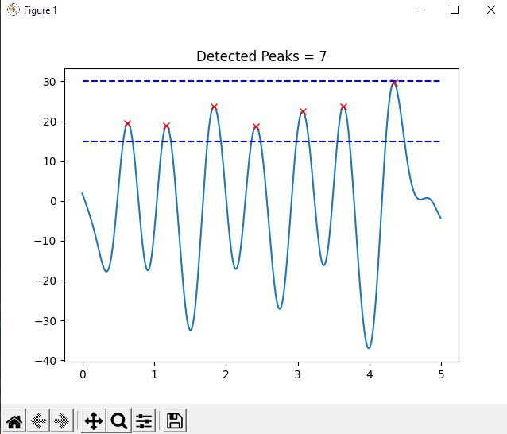

#### by: Zach Miller A16568617

##ReadMe

---
Started: 05/02/2022

---
---
**Tutorial 1** :

This tutorial went over file input into python from csv files. We are able to read
through the csv file and seperate out the values by comma to put it into a python 
array. We can format the csv file exactly how we sent the data from the MCU before
in order to have it work with our old code and future code as well. We used a function
to get the norm of the data as well so we can see the plot relative to x y and z values
combined.

---
---
**Tutorial 2** :

Q1) It becomes an exact copy of the original graph when win is the length of the data
Q2) It becomes noisy again due to the smoothing not being perfect curves and so the 
    derivative will jump around in slope
Q3) If the sample frequency was 120Hz the max would be 60. We would need 20Hz at least
    to see a 0-10Hz bandwidth

This tutorial went over a significant amount of singal processing. The main takeaway
is how we can take a signal and smooth it out so we don't have to worry as much about
the noise from the accelerometer. From this smoothness we can then make a funciton
that gets the peaks within a range. This is useful to our pedometer as well as our
jumping jack counter as both will check for peaks within a different magnitude range.
We creat the DSP module for our library to have access to all these transformations
later on in the lab.

---
---
**Tutorial 3** :

Here we create our pedometer class. It relies heavily on the DSP module we just
created, that way we can use one function to do all the processing for us. We can
either read from a file into arrays and process the arrays with our pedometer, or we
can read in values from Arduino for live processing. Note the live processing can be
a bit laggy due to the computer intensive nature of the live transformations and
plotting. I also went back and added some extra functionality to the pedometer class
outside the scope of the tutorial such as a function to adjust the min and max values
for the detection algorithm as well as functions to get the min and max values for use
in showing their coordinates on the graph. This prevents the need for edits to the 
Pedometer class file which circumvents having to update the package each time we need
a change to occur.

---
---
**Challenge 1** :

For this challenge we relied on our Pedometer class that we had created as part of 
our library. Similar to the tutorial, tutorial_pedometer_online.py we took in a 
constant stream of values from Arduino and processed them with our pedometer class.
We then send a live update status back to arduino that says how many steps we've
taken. Note the importance of sending the message to arduino in every loop, not
just when python receives the data every second, this ensures that the OLED doesn't
only display the step count with 1 second gaps. Note:I currently do not have
bluetooth on my home computer and don't have access to a device that does. I have 
ordered a bluetooth adaptor for future labs, but as of now the videos done by
moving the accelerometer up and down to mimick walking: however, I asked a classmate
for a csv of them walking and jumping to tune my pedometer min and max values to
account for a true test if I had bluetooth. These values are in comments in the
respective challenge files. The CSV is in the data folder titled, classMateMovement.csv

---
---
**Challenge 2** :

This challenge was very similar to Challenge1 but with some more work on the arduino
side of things. A jump counter is essentially a less sensitive step counter, so we
can re-use the pedometer but with a high min/max value check. It was important then
to create a function in the Pedometer class to update the min/max values to more
easily be able to tune both the steps and the jumps. As well as creating a function
to return the min and max values in order to not worry about the scale on the graph.
On arduino we are now
keeping a buffer of the last samples, and sending them to Python only when the button
is pressed. To accomplish this I filled an 512 size array by using the index i%512
which essentially loops through the array. We did a button check like we did in earlier
labs where a full press would be required to send the data over. So in python the code
is modified from challenge 1 to always be trying to receive data, which it will only
process once we get our buffer sent in and then display back both a jump and step
count. Again, for the video purpose I used my hand with motion, but got correctly tuned
min/max values from a csv file provided to me by a classmate which has been noted in 
the challenge 2 comment section.

---