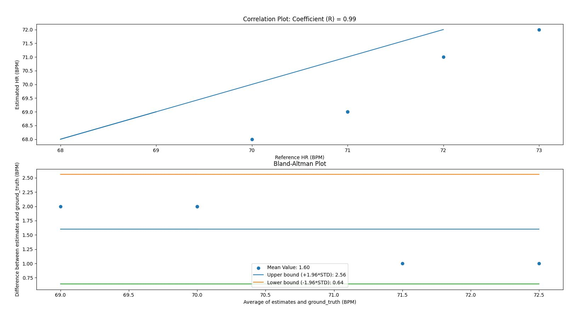

#### by: Zach Miller A16568617
#### worked with Justin Kane-Starr A15554881

##ReadMe

---
Started: 05/02/2022

---
---
**Tutorial 1** :

We can have multiple things on one 12c line because each device has its own address
and so despite the same wires we can separate how they receive the information.

The while(1) statement creates an infinite loop that stops anything from happening.

led Brightness of 25mA ledBrightness= 122.5. Red+Ir ledMode=2. sampleRate=200. adcRange
=8192.

It changes the amount of time the LEDs shine into the finger before determining if
there was a pulse. A larger number = longer led on time for the leds. Units are microSeconds

14 bits are needed for 18384 adc

red w= 660nm, ir w= 880nm, green w= 537nm

To get green, use mode 3 and use particleSensor.getGreen()

---
---
**Tutorial 2** :

I think that the ost important part of this tutorial was about normalizing the data.
I wish Id have done it with the Pedometer, inf act I might go back and do it like that.
It makes the readability of the graphs much better and it seems to make tuning
the peak detector part of the system a lot easier. I added a section to the HRM class
that wasn't discussed in the PPG part which was a lowpass filter. I found this gave
me more accurate results.

---
---
**Tutorial 3** :

I had no issues with the data collection at this stage. This is most likely because
I did it over serial instead of bluetooth and used a rubber band. My counts were
pretty close however I think its possible some were off by 1 or 2 depending when 
python started to count vs me.

---
---
**Challenge 1** :

I only changed the design of the HRMonitor slightly to achieve the beats wanted. I added
a lowpass filter to further try to smooth the signal and reduce noise. I found that
this got my correlation from about 0.82 to 0.99. I believe the issue with my HRM at
this stage is more to do with my counting of the heartbeats outside the scope of python.
It seemed as if for every signal I counted one at the start or end that wasn't captured
by python and thus my csv files were lacking them despite me counting them during the 
upload process.

---
---
**Challenge 2** :
Using the basis of the old Pedometer class, I just added the information from
the tutorial to read in data from the IR led from arduino. Every second I would
update the display if there wa s new calculated heart rate otherwise I display
what was displayed ont he last cycle. One trick was displaying the heartrate
on the OLED as we need to break off the decimal value from the HRM, or at least
it looked cleaner this way.

---
---
**Challenge 3** :
For this challenge I followed closely to the tutorial for getting the video
frames and then getting the average red value. I did have to mess with the 
time library a bit to make sure everything was flowing smoothly. I found it
most efficient to add the frames directly to the HRM rather than adding them
to an array and then adding parts of the array over. The arduino side of things
was the same as in challenge 2

---