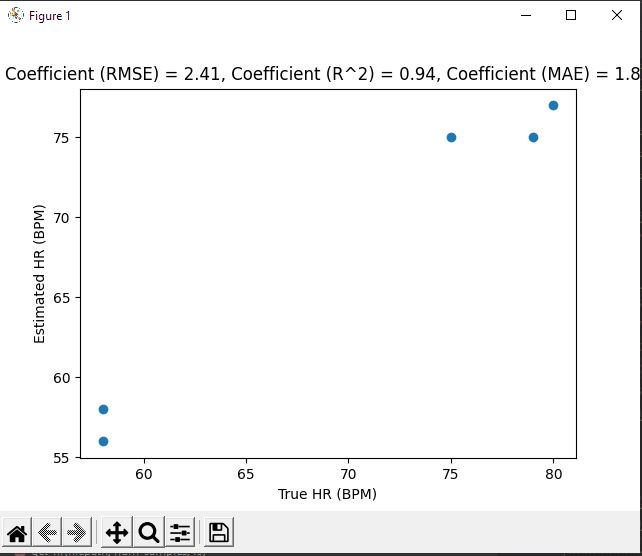
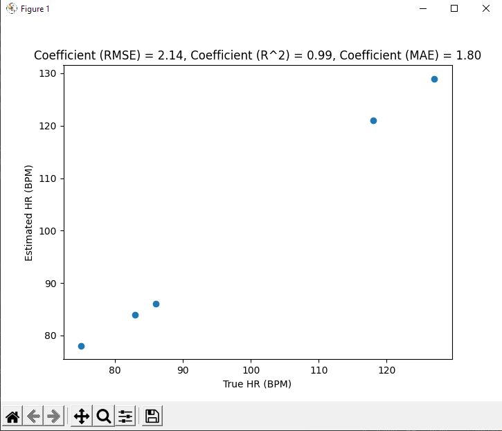
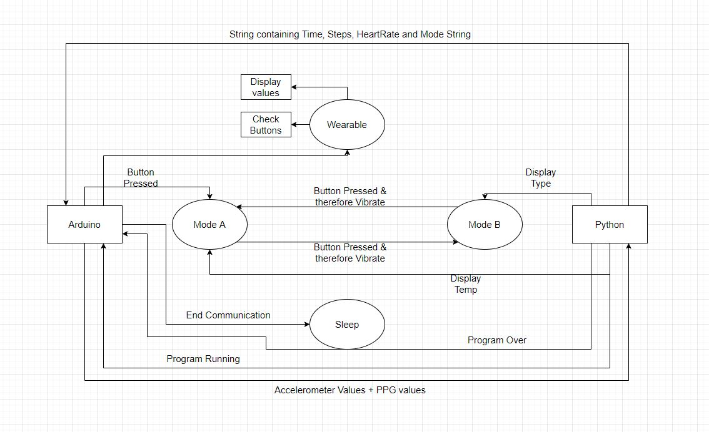

#### by: Zach Miller A16568617

##ReadMe

---
Started: 05/16/2022

---
---
**Tutorial 1** :
This tutorial walked us through how to use glob to read files from a
directory which we can use to read in all the heartbeat data that was 
collected last week. This step was critical as it showed us what data
was horrible and to leave out for later parts of the lab. It also showed
us which files had bad sampling frequency to also omit.

---
---
**Tutorial 2** :
We are using a Gaussian mixture model in order to do our ML process. The
basis for this model is to take all the data points and create Gaussian
curves (bell curves) around similar sets of data. So for our case we are
using 2 bell curves, 1 to denote no heartbeat and 1 to denote heartbeat.
Therefore the no heartbeat curve will be much greater as we are passing
in the function of the derivative so there is much more low end values. We
train the data by omitting one subject and comparing it to our prediction.

---
---
**Challenge 1** :
For this challenge we looked to see how accurate our ML model was for predicting
heart rate. First we tested the RMSE (root mean square error) which follows 
the derivation from the videos. This tells us how concentrated the data is
along the line of best fit. Then I also tested the ML model with a R^2 plot.
The R^2 tells us the relationship between the ML model and dependent variable.
In other words This will show how much the variance between data points 
differs from true correlation.
ex 0.5 means ~half of the results can be explained from the ML model.
The third test to see how good the ML model was that I did was the MAE (Mean
Absolute Error) which tells us the average difference between our expected 
from the true and calculated values. In other words, this measures the 
average magnitude of error of the results as compared to the true values. Some
Examples of the results are shown below.

Note: Some of the uploaded data was absolute trash in the sense of what 
the reported heart-rate should have been comparred to what it was reported
so for many of the data, the ML model predicted something very different
than the reported values, and it is arguable that the ML model was more
accurate.

---
---
**Challenge 2** :
This takes the methods given from Challenge 1 and integrates them into a
real-time heart-rate monitor. Note: it is important to reduce the length
of the ppg by lowering the samples so we do not have to wait for say a minute
before it displays a proper heart-rate. We also don't want the sample count
to be too low or the model will be worse at seeing whats happening. To train
the model I had the system run through all the data files from before minus
the most egregiously bad ones. After, it was ran like the pedometer with values
being added to the HR monitor instead of PED class. I did notice however that
the ML version seemed to give higher heartrate counts in the live version than
in challenge 1, and I think it just has to due with the sample count and 
the bad data that the model is training on but im not completely sure. A
video is attatched below to show it running.

---
---
**Challenge 3** :
This challenge combines everything from all the previous challenges.
Essentially all im doing is taking challenge 2 from this lab, re-adding 
the pedometer back in and adding in the Weather module from lab 3. Between
these 3 elements, the python side of things is cokmplete. In arduino we need
to re-add the motor module and the logic for the button. The basis for the 
way my system works is that the button switches between 2 modes, which change
the weather to display from temp to type and back again.I also created a 
touch feedback on the button so when the button is pressed we get a buzz feeling
to know that it was pressed properly and the mode will switch. A video-ish
demo is shown below of the button switching the states and the motor buzzing.
There is a drawing of a state machine as well.

---