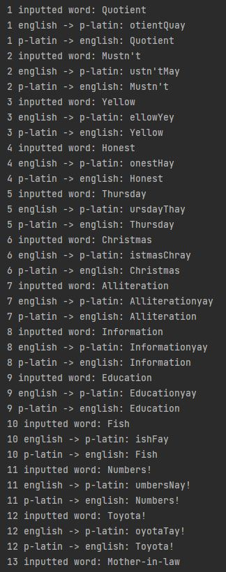
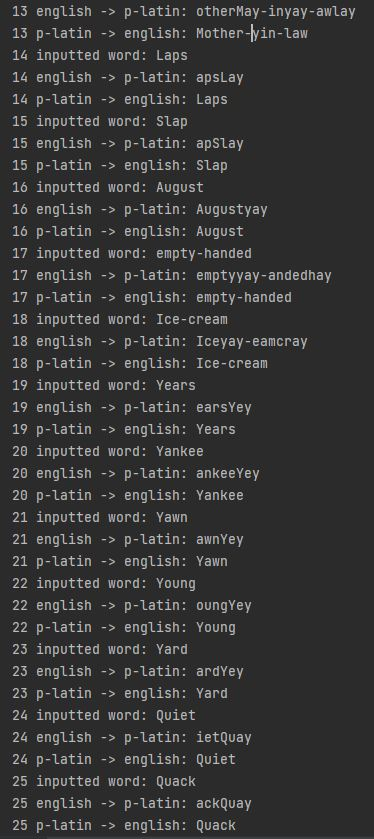

#### by: Zach Miller A16568617

##ReadMe

---
Started: 4/3/2022

---
**Tutorial_python_basics** :
    The most important takeaway for me from this, is that you cannot change 
strings once they are created. THs tutorial was really meant to show us the 
rules of the python language more than anything, about how you can mix 
datatypes in lists and what you can and cant do to edit lists, etc.

---
**Tutorial_numpy** :
    We had tasks to do in the numpy tutorial as explained below.
**Task_1** : Here we just subtracted an int from the array which subtracts
            that constant from every element

**Task_2** : This was possible by indexing out parts of the rows and using
            vstack to stack out the sections vertically

**Task_3** : I used hstack to horizontally duplicate the numbers then called
            vstack on the already hstacked aray to get a height of 4

**Task_4** : This was done by simply using arange with the start and end+1
            positions and passing in the correct spacing

**Task_5** : This is different from arange because you give it the start and
            end and it handles giving an even spacing between the points

**Task_6** : First I hand solved what the array would look like then broke it
            into sections, the bottom row was  4231 which I realized was 
            accomplished by an arange and then switching of two infdexes
            i noticed the top right 2x2 quadrant was acheivable by making
            a 2x2 ones matrix and multiplying the right column by 2. Lastly
            I had to deal with the top left two numbers which I realized would
            probably be beter harcoded, but used an arange to stay within the
            guidelines of the problem. Combining all these sections into the 
            zeros matrix gave the proper result.

**Task_7** : Here I acheived the task by splitting the string into an array 
            using the .split() command and then assigned array7 to that
            .split(). Then I could just run a 99x for loop that woud stack
            one row per loop to get a 100x4 array

---
**Challenge_1** :
    This task played kind of like the tutorials but with more active
    Excercises. More than anything this challenge looked to improve the 
    users speed with python programming. I had to look up the documentation
    for certain functions on stackOverflow, but it made me faster. In regards
    to how each excercise was completed, there is code within the 
    challenge1_worksheet.py file

---
**Challenge_2** :
    This challenge looked to gamiliarize us more with arrays in python.
    Specifically we had to have a better understanding of how to iterate
    through them. It required us to first loop through the days to create
    a plan for buying and selling, and then loop through our plan to
    calculate what our profits would have been and how many shares we
    would've had

---
**Challenge_3** :
    This challenge was the most difficult of the three and required us
    to make a piglatin translator from both eng to pig and pig to eng.
    The basic premise is outlined in the Challenge 3 documentation assignment
    but there were a few hurdles that made it difficult. Specifically we 
    had to deal with hyphens and punctuation. I outlined how the functions
    work in comments of the challenge3_piglatin.py file. I was able to get
    all the words coded and only had one fail to decode: 13 Mother-in-law. I
    believe my fault lies in the fact that "in" is only two characters long
    but i'm not 100% sure. Below are my results from the code.

---